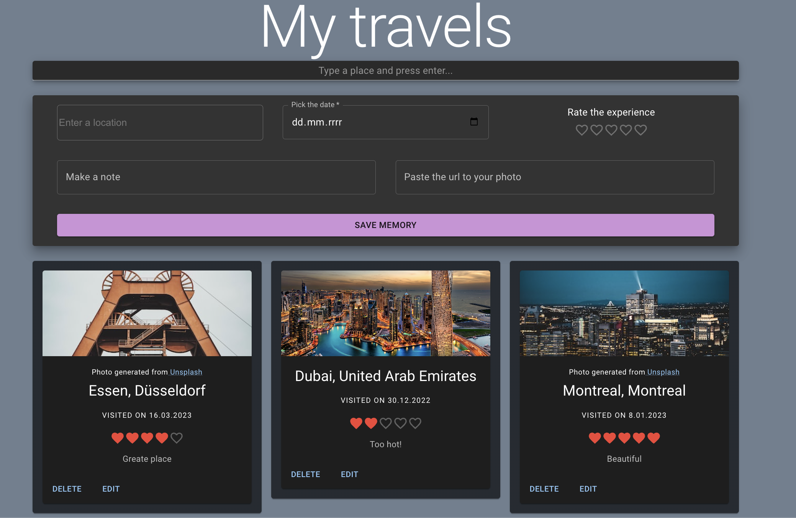

# VisitedPlacesApp

 

:construction: App in progress, preview and live app will be here soon :construction:

## Welcome! 👋

This is Visited Places App, that lets you manage your favorite visited places.

## Features

In this app you can perform cation that allows to filter colors depending on id fetched from reqres API and show item's details. It was built in React (TypeScript).
It includes server side filtering and pagination, error handling and url search params. 
UI was built using Material UI, thanks to that, there is simple theme toggle for dark and light theme. 

## Tools used

- React
  - Vite
  - Material UI
  - Axios
  - Context
  - Custom hooks
- Mockapi.io (restful interface)
- Unsplash API
- Google Places API & React-Google-Autocomplete
- React-Hook-Form

## Live app :tada:

:construction: App in progress, preview and live app will be here soon :construction:

- [App live on Netlify]()
